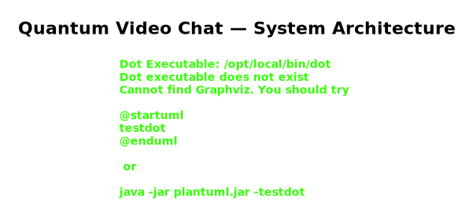
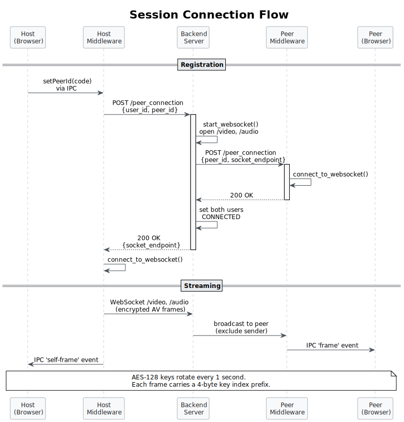
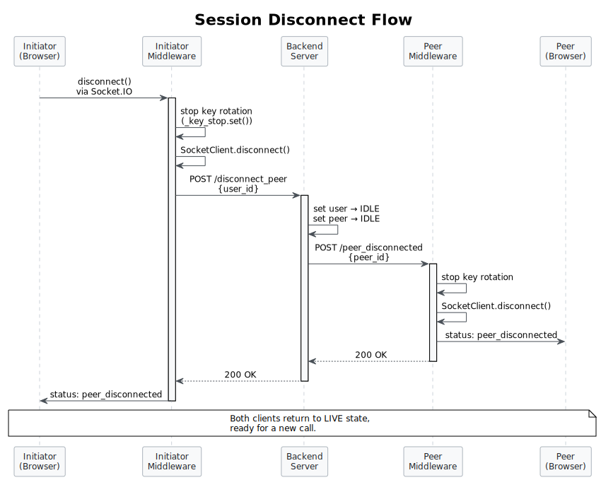
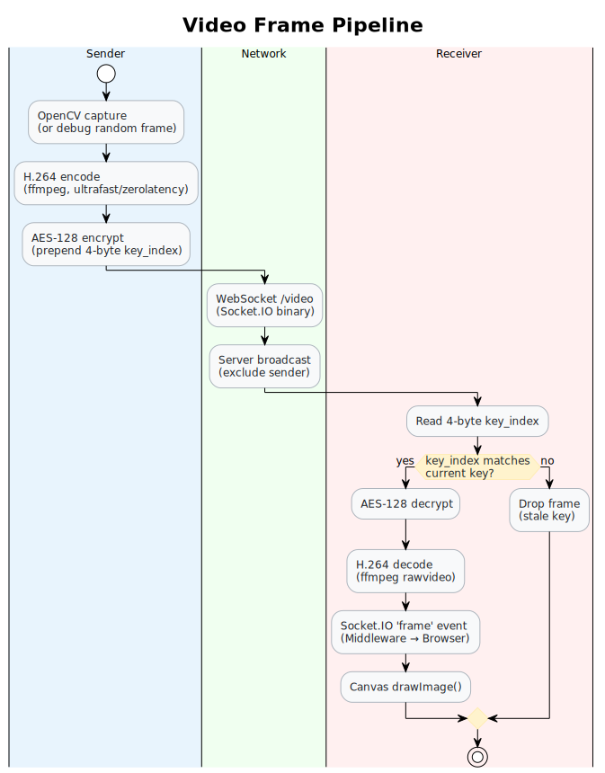
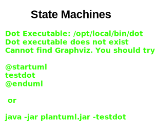

# Quantum Video Chat

A secure, peer-to-peer video chat application built around quantum key distribution (QKD) principles. Encrypted audio and video streams are exchanged between peers using AES-128 keys that rotate every second, with support for file-based key injection from real QKD hardware.

---

## Architecture

Three processes collaborate at runtime:



All three processes share a common Python library (`shared/`) that provides encryption, endpoint handling, state enums, AV namespace logic, and centralised configuration.

> Diagrams are maintained as [PlantUML](https://plantuml.com/) sources in [`docs/diagrams/`](docs/diagrams/) and auto-rendered by CI on push.

---

## Project Structure

```
quantum-video-chat/
├── start.sh                              # Dev launcher (bash start.sh client|server)
├── pytest.ini                            # Pytest config (paths, markers)
│
├── shared/                               # Shared Python library
│   ├── adapters.py                       # FrontendAdapter ABC
│   ├── config.py                         # Centralised config (ports, AV, crypto)
│   ├── decorators.py                     # Shared exception-handling decorators
│   ├── encryption.py                     # AES/XOR/Debug encryption + key generators
│   ├── endpoint.py                       # Endpoint URL builder
│   ├── exceptions.py                     # Unified exception hierarchy + Errors enum
│   ├── logging.py                        # Shared logging setup
│   ├── parameters.py                     # Request parameter extraction
│   ├── state.py                          # ClientState enum
│   └── av/
│       └── namespaces.py                 # Audio/Video/Key client + Flask namespaces
│
├── server/                               # Backend server
│   ├── main.py                           # Entry point
│   ├── rest_api.py                       # ServerAPI (Flask REST, :5050)
│   ├── socket_api.py                     # SocketAPI (Flask-SocketIO, :3000)
│   ├── server.py                         # User lifecycle, WebSocket management
│   ├── peer_manager.py                   # PeerConnectionManager (connect/disconnect orchestration)
│   ├── state.py                          # APIState, SocketState enums
│   ├── exceptions.py                     # Server-specific exceptions
│   ├── custom_logging.py                 # Server logging config
│   └── utils/
│       ├── av.py                         # Server AV namespace generation
│       ├── encryption.py                 # Re-exports from shared
│       ├── user.py                       # User model + UserState enum
│       └── user_manager.py               # In-memory user storage + manager
│
├── middleware/                           # Python middleware (browser ↔ server bridge)
│   ├── video_chat.py                     # Entry point — connects to browser via Socket.IO
│   ├── custom_logging.py                 # Middleware logging config
│   ├── dev_python_config.json            # Dev server endpoint config
│   ├── python_config.json                # Production server endpoint config
│   ├── requirements.txt                  # Python dependencies
│   ├── adapters/
│   │   └── socket_adapter.py             # SocketAdapter (FrontendAdapter impl)
│   └── client/
│       ├── client.py                     # Client orchestrator (connect, disconnect, kill)
│       ├── socket_client.py              # SocketClient (WebSocket connection)
│       ├── server_comms.py               # ServerCommsMixin (REST to backend)
│       ├── api.py                        # ClientAPI (Flask, :4000)
│       ├── av.py                         # Client AV (key rotation, video encode)
│       ├── endpoint.py                   # Re-exports from shared
│       ├── errors.py                     # Client error enum
│       └── util.py                       # ClientState, parameter helpers
│
├── frontend/                             # React browser app
│   ├── settings.ini                      # Persisted user settings (INI format)
│   ├── package.json                      # npm dependencies + scripts
│   ├── src/
│   │   ├── middleware/                    # Lightweight Python middleware (browser-facing)
│   │   │   ├── client.py                 # Entry point + port detection + shutdown
│   │   │   ├── state.py                  # MiddlewareState — centralised mutable state
│   │   │   ├── video.py                  # VideoThread — camera capture + frame emission
│   │   │   ├── server_comms.py           # QKD server REST communication + health checks
│   │   │   └── events.py                 # Socket.io + REST event handler registration
│   │   ├── renderer/
│   │   │   ├── App.tsx                   # Router + global connection status state
│   │   │   ├── platform.ts              # Browser platform API (settings, events)
│   │   │   ├── screens/
│   │   │   │   ├── MainScreen.tsx        # Single-screen layout (composes sub-components)
│   │   │   │   ├── Start.tsx             # Home — start or join a session
│   │   │   │   ├── Join.tsx              # Session code entry form
│   │   │   │   ├── Session.tsx           # Active session — video, chat, hang up
│   │   │   │   └── Settings.tsx          # Settings panel (network, AV, crypto, debug)
│   │   │   ├── hooks/
│   │   │   │   ├── useConnection.ts      # Middleware/server connectivity lifecycle
│   │   │   │   ├── useSession.ts         # User registration, room join/leave, frames
│   │   │   │   └── useMedia.ts           # Camera/mic toggle state
│   │   │   ├── utils/
│   │   │   │   ├── ClientContext.tsx      # Composes hooks into single React context
│   │   │   │   ├── socket.ts             # Socket.io client connection utilities
│   │   │   │   ├── canvas.ts             # Canvas drawing helpers (toRGBA, drawOnCanvas)
│   │   │   │   └── theme.ts              # Theme persistence + DOM management
│   │   │   └── components/
│   │   │       ├── Header.tsx            # Status-aware header bar
│   │   │       ├── ControlBar.tsx        # Server connect + room join forms
│   │   │       ├── MediaControls.tsx     # Camera/mic toggle buttons
│   │   │       ├── ErrorPanel.tsx        # Collapsible error log panel
│   │   │       ├── StatusBar.tsx         # Session status display (user/room/port)
│   │   │       ├── VideoPlayer.tsx       # Video stream display
│   │   │       ├── ConnectionStatus.tsx  # ServerBadge + PeerBanner + ConnStatus type
│   │   │       ├── StatusPopup.tsx       # Connection status overlay
│   │   │       ├── chat/                 # Chat panel (Chat.tsx, Message.tsx)
│   │   │       └── widgets/              # QKD metric widgets (Circle, Rectangle, Status)
│   │   └── __tests__/                    # Jest tests for components + screens
│   └── ...
│
├── docs/diagrams/                        # PlantUML sources + rendered SVG/PNG
│
├── tests/                                # Python test suite
│   ├── conftest.py                       # Root fixtures + path setup
│   ├── server/                           # Server unit tests
│   │   ├── test_rest_api.py              # REST endpoint tests
│   │   ├── test_server.py                # Server logic + disconnect tests
│   │   ├── test_socket_api.py            # WebSocket API tests
│   │   ├── test_socket_api_events.py     # WebSocket event handler + run tests
│   │   ├── test_user.py                  # User model tests
│   │   ├── test_user_manager.py          # Storage + manager tests
│   │   └── test_state.py                 # State enum tests
│   ├── middleware/                        # Middleware unit tests
│   │   ├── test_client.py                # Client + disconnect tests
│   │   ├── test_client_api.py            # ClientAPI endpoint tests
│   │   ├── test_socket_client.py         # SocketClient tests
│   │   ├── test_server_comms.py          # Server communication tests
│   │   ├── test_av.py                    # AV pipeline tests
│   │   ├── test_socket_adapter.py        # Adapter tests
│   │   └── test_util.py                  # Utility tests
│   ├── shared/                           # Shared library unit tests
│   │   ├── test_encryption.py            # Encryption round-trip tests
│   │   ├── test_endpoint.py              # Endpoint tests
│   │   ├── test_config.py                # Config loading tests
│   │   └── ...
│   ├── test_connection_flow.py           # Integration: connect + disconnect lifecycle
│   ├── test_data_transmission.py         # Integration: encrypted AV data flow
│   └── test_live_e2e.py                  # Live e2e: real processes, video + messaging
│
└── icebox/                               # Experimental / legacy code
```

---

## Session Flow

### Connecting



1. **Host** clicks "Start Session" — a random session code is generated and displayed.
2. **Client** enters the code on the Join screen.
3. The browser emits `connect_to_peer` to the Python middleware over Socket.IO (:5001).
4. Middleware calls `POST /peer_connection` on the backend server.
5. Server starts a shared WebSocket namespace and contacts the peer's ClientAPI (:4000).
6. Both clients connect to the shared WebSocket and begin streaming encrypted AV.

### Disconnecting



1. Either user clicks "Hang Up" in the Session screen.
2. The browser emits `disconnect_call` to the middleware via Socket.IO.
3. Middleware calls `Client.disconnect_from_peer()`:
   - Stops AV key rotation (`_key_stop.set()`)
   - Disconnects from the WebSocket
   - Sends `POST /disconnect_peer` to the backend server
   - Emits `peer_disconnected` status to the frontend
4. Server resets both users to `IDLE` and sends `POST /peer_disconnected` to the peer's ClientAPI.
5. The peer's middleware cleans up its WebSocket and emits `peer_disconnected` to its frontend.
6. Both clients return to `LIVE` state, ready for a new call.

---

## Video Frame Lifecycle



Keys rotate every **1 second** in a dedicated daemon thread. Each encrypted payload is prefixed with a 4-byte key index so the receiver can synchronise decryption. A `threading.Lock` protects the shared key state from data races.

A debug video mode (`DEBUG_VIDEO=true`) replaces the camera feed with random grayscale frames, enabling headless testing without a webcam.

---

## Encryption

Three encryption schemes, selected via `shared/config.py` or the Settings screen:

| Scheme | Description |
|--------|-------------|
| `AESEncryption` | AES-128 CBC (default) |
| `XOREncryption` | XOR cipher |
| `DebugEncryption` | Passthrough — no encryption |

Three key generators:

| Generator | Description |
|-----------|-------------|
| `RandomKeyGenerator` | Cryptographically random keys |
| `FileKeyGenerator` | Reads keys from `key.bin` (for real QKD hardware) |
| `DebugKeyGenerator` | Fixed key for testing |

---

## Configuration

Runtime settings can be configured in three ways (highest priority first):

1. **Environment variables** (`QVC_*` prefix)
2. **Settings INI file** (`settings.ini`, editable from the in-app Settings screen)
3. **Hardcoded defaults** in `shared/config.py`

| Constant | Default | Env Override |
|----------|---------|-------------|
| Middleware port | 5001 | `QVC_IPC_PORT` |
| Server REST port | 5050 | `QVC_SERVER_REST_PORT` |
| Server WebSocket port | 3000 | `QVC_SERVER_WS_PORT` |
| Client API port | 4000 | `QVC_CLIENT_API_PORT` |
| Video shape | 640x480 | — |
| Frame rate | 15 fps | — |
| Sample rate | 8196 Hz | — |
| Key length | 128 bits | — |
| Debug video | false | `QVC_DEBUG_VIDEO` |

The middleware also reads server connection details from a JSON config file:

- `middleware/dev_python_config.json` (when `DEV = True`)
- `middleware/python_config.json` (production)

---

## State Machines



---

## REST API Endpoints

### Server (`:5050`)

| Method | Route | Description |
|--------|-------|-------------|
| POST | `/create_user` | Register a new client, returns `user_id` |
| POST | `/peer_connection` | Initiate peer connection handshake |
| POST | `/disconnect_peer` | Disconnect a user from their active peer |
| DELETE | `/remove_user` | Unregister a client on shutdown |

### Client API (`:4000`)

| Method | Route | Description |
|--------|-------|-------------|
| POST | `/peer_connection` | Receive incoming peer connection request |
| POST | `/peer_disconnected` | Receive notification that peer has hung up |

---

## Running Locally

The `start.sh` script handles port detection and process lifecycle:

```bash
# Terminal 1 — Backend server
bash start.sh server

# Terminal 2 — Client (browser + middleware)
bash start.sh client
```

For a two-client session on one machine, run `bash start.sh client` in two separate terminals. Each instance auto-selects free ports to avoid conflicts.

### Manual startup

```bash
# 1. Backend server
cd server && python3 main.py

# 2. Frontend (starts renderer and middleware)
cd frontend && npm install && npm run start:renderer
```

---

## Testing

```bash
# All unit + integration tests (excludes live e2e)
python -m pytest tests/ --ignore=tests/test_live_e2e.py

# Live end-to-end tests (spawns real server + two clients)
python -m pytest tests/test_live_e2e.py -v -s

# Full suite
python -m pytest tests/ -v

# Frontend tests
cd frontend && npm test
```

**Test coverage:**
- **455 Python tests** across unit, integration, and e2e layers
- **80 Jest tests** for React components, screens, and hooks

---

## Diagrams

All architecture and flow diagrams are maintained as PlantUML source files in [`docs/diagrams/`](docs/diagrams/). A [GitHub Actions workflow](.github/workflows/render-diagrams.yml) automatically re-renders them to SVG and PNG whenever a `.puml` file is modified.

To render locally:

```bash
# Requires Java and plantuml.jar
java -jar plantuml.jar -tsvg -o . docs/diagrams/*.puml
```

---

## Key Design Decisions

- **`shared/` library**: Eliminates duplicated Python code between server and middleware. Both import from `shared/` via `sys.path`. Includes shared exception-handling decorators (`shared/decorators.py`) and a unified exception hierarchy (`shared/exceptions.py`).
- **`FrontendAdapter` ABC**: Decouples the middleware from the Socket.IO transport. The `SocketAdapter` is the only class that knows about socket.io; everything else codes against the abstract interface.
- **Composition over inheritance**: `SocketAPI` owns a `Thread` rather than extending it, keeping the class open for extension without coupling to threading internals. `Server` delegates peer connection workflows to `PeerConnectionManager`.
- **React hooks for state separation**: `ClientContext` composes three focused hooks (`useConnection`, `useSession`, `useMedia`) rather than managing all state inline. Each hook has a single responsibility and can be tested independently.
- **Middleware module decomposition**: The lightweight Python middleware (`frontend/src/middleware/`) separates concerns into `state.py` (centralised mutable state), `video.py` (camera capture), `server_comms.py` (QKD server REST calls), and `events.py` (event handler registration), with `client.py` as a thin entry point.
- **MainScreen component composition**: The single-screen UI composes `ControlBar`, `MediaControls`, `ErrorPanel`, and `StatusBar` components, each owning its own state and socket listeners.
- **Daemon threads for AV**: Audio capture, video capture, and key rotation each run in daemon threads. A `threading.Event` (`_key_stop`) enables clean shutdown of key rotation on disconnect.
- **Thread-safe key state**: The rotating encryption key (`AV.key`) is protected by a `threading.Lock` to prevent data races between the key rotation thread and the AV streaming threads.
- **SID tracking for disconnect**: The `SocketAPI` maps socket session IDs to user IDs, enabling proper state cleanup when clients disconnect unexpectedly.
- **TOCTOU-safe port binding**: The middleware detects port collisions at startup with `SO_REUSEADDR=0` probing and auto-increments to a free port, preventing two instances on the same machine from silently sharing a port.
- **Settings INI with no dependencies**: A zero-dependency INI parser/serialiser, with defaults mirrored in both TypeScript and Python.

---

## Tech Stack

| Layer | Technologies |
|-------|-------------|
| UI | React, React Router, Material UI, TypeScript |
| Bundler | Webpack 5, webpack-dev-server |
| Backend server | Python, Flask, Flask-SocketIO, gevent |
| Middleware | Python, python-socketio, Flask |
| Video | OpenCV (cv2), ffmpeg-python, H.264 |
| Audio | PyAudio |
| Encryption | PyCryptodome (AES-128 CBC) |
| Networking | psutil (interface discovery) |
| Testing | pytest, Jest, React Testing Library |
